# User Flows and Interactions - Agently Home Hub

## 1. Overview
This document maps out comprehensive user flows across the Agently Home Hub platform, covering happy paths, edge cases, and error scenarios for all user roles.

## 2. Tenant User Flows

### 2.1 Property Search and Booking Flow

#### Happy Path
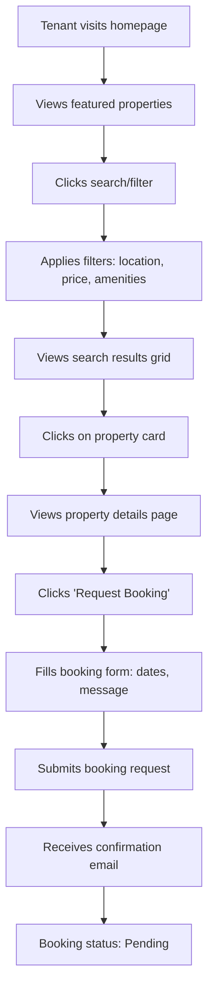

#### Edge Cases
- **No search results**: Display "No properties found" with suggestions to adjust filters
- **Property unavailable**: Show next available date or alternative properties
- **Incomplete profile**: Prompt to complete profile before booking
- **Multiple concurrent bookings**: Allow up to 3 pending requests per user

#### Error Scenarios
- **Network failure**: Show retry option with offline caching
- **Server error**: Display user-friendly error message with support contact
- **Invalid dates**: Highlight date picker with validation message
- **Duplicate booking**: Check for existing requests and prevent duplicates

### 2.2 Maintenance Request Flow

#### Happy Path
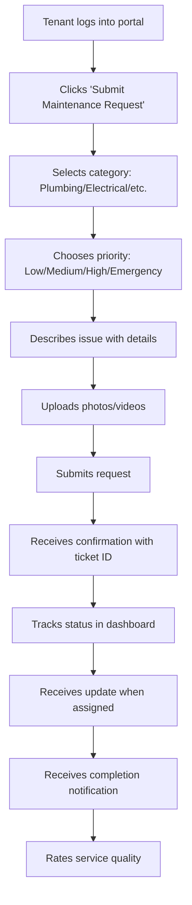

#### Edge Cases
- **Emergency request**: Immediate notification to landlord and on-call contractor
- **After-hours submission**: Queued for next business day processing
- **Bulk requests**: Limit to 5 open requests per property
- **Recurring issues**: Flag for preventive maintenance scheduling

#### Error Scenarios
- **File upload failure**: Retry with smaller files or alternative format
- **Invalid category**: Show category selection with examples
- **Missing description**: Required field validation
- **Service unavailable**: Maintenance system offline message

### 2.3 Roommate Matching Flow

#### Happy Path
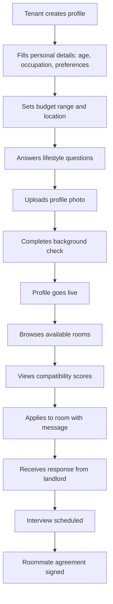

#### Edge Cases
- **No matches found**: Suggest profile improvements or broader criteria
- **Multiple applications**: Track application status across rooms
- **Group formation**: Handle multi-person roommate applications
- **Profile incomplete**: Progressive profile completion prompts

#### Error Scenarios
- **Background check failure**: Clear rejection with appeal process
- **Photo upload issues**: Alternative verification methods
- **Compatibility algorithm error**: Manual review option
- **Duplicate profiles**: Account merging or prevention

## 3. Landlord User Flows

### 3.1 Property Listing Flow

#### Happy Path
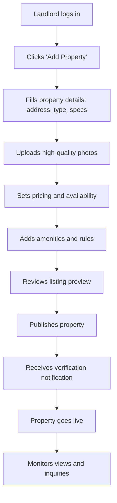

#### Edge Cases
- **Bulk property upload**: CSV import for multiple properties
- **Property already listed**: Update existing listing option
- **Incomplete information**: Save as draft functionality
- **High-value property**: Enhanced verification process

#### Error Scenarios
- **Address validation failure**: Google Maps integration issues
- **Photo upload limits**: Compression and optimization suggestions
- **Duplicate listing**: Detection and merge options
- **Pricing validation**: Market rate comparison warnings

### 3.2 Booking Management Flow

#### Happy Path
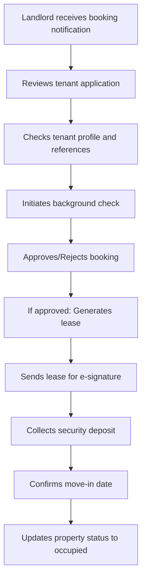

#### Edge Cases
- **Conditional approval**: Additional requirements (co-signer, etc.)
- **Waitlist management**: Multiple applicants for popular properties
- **Booking cancellation**: Refund policy application
- **Lease renewal**: Automatic renewal options

#### Error Scenarios
- **Background check service down**: Manual review process
- **E-signature failure**: Alternative signing methods
- **Payment processing error**: Manual payment collection
- **Tenant verification issues**: Additional documentation requests

## 4. Agent User Flows

### 4.1 Lead Management Flow

#### Happy Path
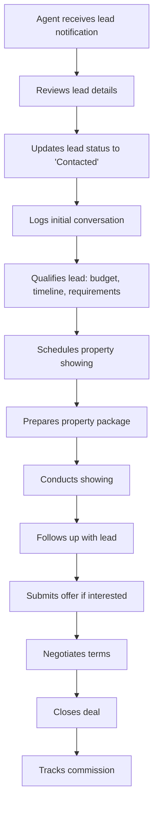

#### Edge Cases
- **Lead quality issues**: Requalification or disqualification
- **Multiple agents on same lead**: Assignment conflicts
- **International leads**: Additional compliance requirements
- **Lead source tracking**: Attribution for marketing analysis

#### Error Scenarios
- **CRM system offline**: Offline lead capture
- **Calendar conflict**: Alternative time suggestions
- **Lead data incomplete**: Data enrichment from public sources
- **Commission calculation error**: Manual override capabilities

### 4.2 Property Showing Flow

#### Happy Path
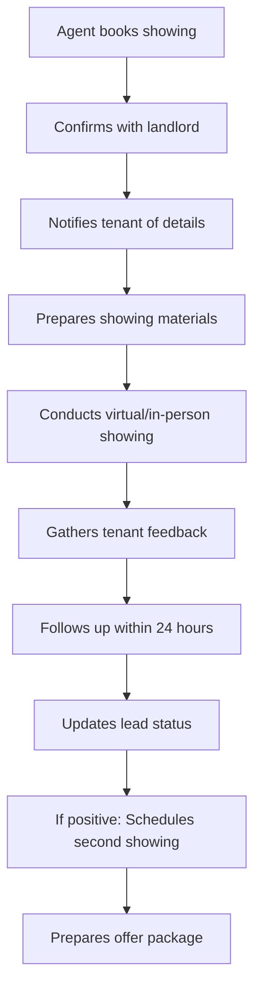

#### Edge Cases
- **Virtual showings**: Video tour integration
- **Group showings**: Multiple prospects simultaneously
- **After-hours access**: Key management system
- **Property condition issues**: Emergency repairs coordination

#### Error Scenarios
- **No-show by tenant**: Rescheduling protocol
- **Property access denied**: Emergency contact procedures
- **Technical issues (virtual)**: Backup communication methods
- **Feedback collection failure**: Alternative survey methods

## 5. Admin User Flows

### 5.1 User Management Flow

#### Happy Path
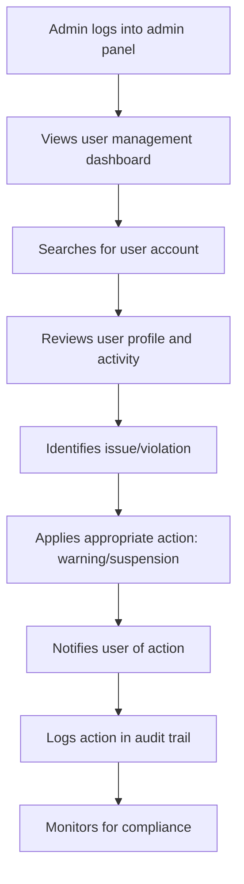

#### Edge Cases
- **Bulk user operations**: Mass account updates
- **Account recovery requests**: Verification processes
- **VIP user handling**: Elevated support protocols
- **Legal hold requests**: Data preservation procedures

#### Error Scenarios
- **Permission issues**: Role verification failures
- **Audit logging errors**: Manual logging procedures
- **Notification delivery failure**: Alternative contact methods
- **Data corruption**: Backup restoration processes

### 5.2 Content Moderation Flow

#### Happy Path
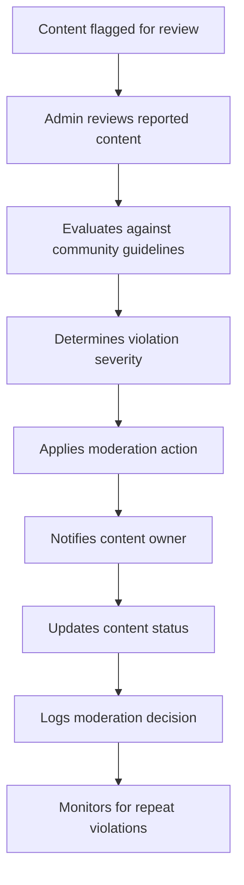

#### Edge Cases
- **Borderline content**: Escalation to senior moderator
- **Cultural context considerations**: Localized guideline application
- **User appeals**: Review and reversal processes
- **Automated moderation conflicts**: Human override capabilities

#### Error Scenarios
- **Content loading issues**: Alternative access methods
- **Decision logging failure**: Manual documentation
- **Notification system down**: Direct user communication
- **Escalation path blocked**: Alternative resolution methods

## 6. Cross-Platform Flows

### 6.1 Payment Processing Flow

#### Happy Path
```mermaid
flowchart TD
    A[User initiates payment] --> B[Selects payment method]
    B --> C[Enters payment details]
    C --> D[Security verification (3DS/CVV)]
    D --> E[Payment processing]
    E --> F[Payment gateway confirmation]
    F --> G[Platform records transaction]
    G --> H[User receives confirmation]
    H --> I[Funds transferred to recipient]
```

#### Edge Cases
- **Partial payments**: Installment plan handling
- **Currency conversion**: Multi-currency support
- **Payment retries**: Failed payment recovery
- **Refund requests**: Automated/manual processing

#### Error Scenarios
- **Payment gateway timeout**: Retry with exponential backoff
- **Insufficient funds**: Clear error messaging
- **Card declined**: Alternative payment suggestions
- **Fraud detection trigger**: Additional verification steps

### 6.2 Document Generation Flow

#### Happy Path
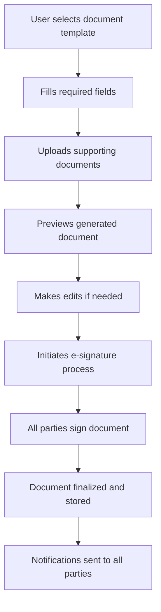

#### Edge Cases
- **Multi-language documents**: Translation integration
- **Complex legal requirements**: Legal review triggers
- **Document amendments**: Version control
- **Bulk document generation**: Batch processing

#### Error Scenarios
- **Template rendering failure**: Fallback to manual creation
- **E-signature service down**: Alternative signing methods
- **Field validation errors**: Clear error messages with guidance
- **Document storage failure**: Local save with retry option

## 7. Error Handling and Recovery Flows

### 7.1 Network Connectivity Issues

#### Recovery Flow
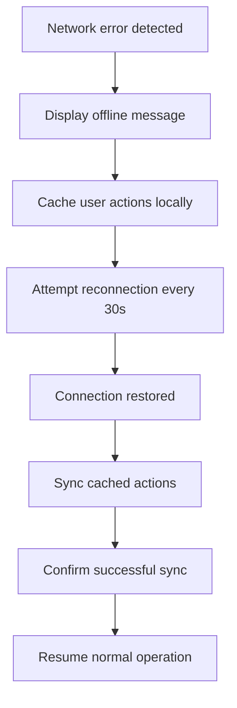

### 7.2 Session Timeout

#### Recovery Flow
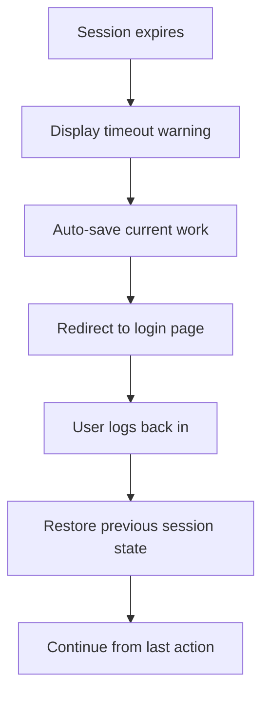

### 7.3 Data Validation Errors

#### Recovery Flow
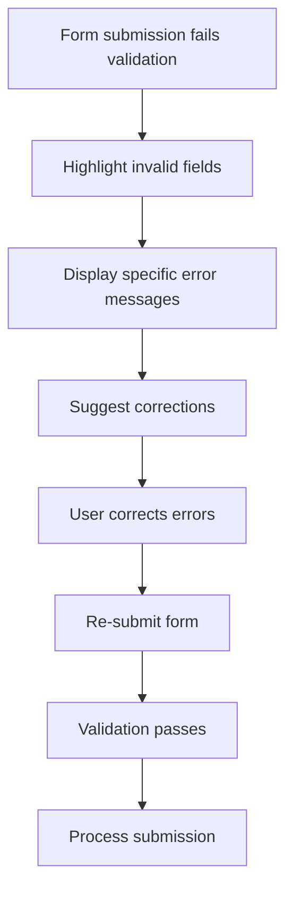

## 8. Performance and Scalability Flows

### 8.1 High Traffic Handling

#### Load Balancing Flow
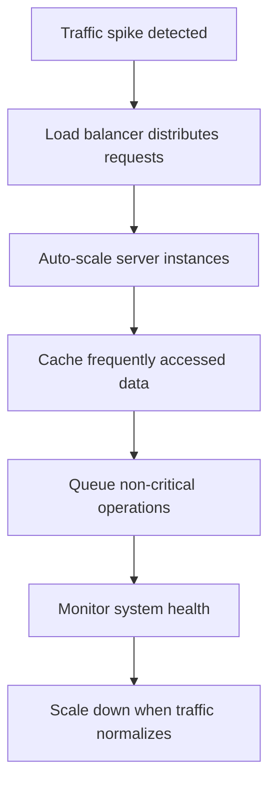

### 8.2 Database Performance

#### Optimization Flow
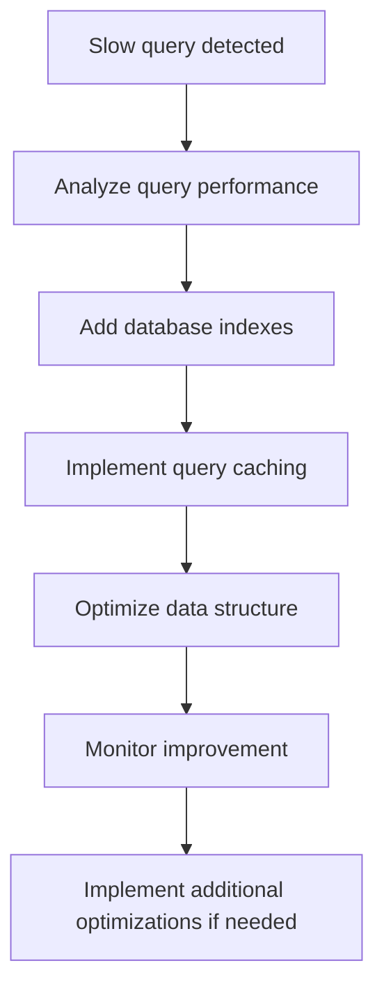

## 9. Security Incident Response Flows

### 9.1 Suspected Security Breach

#### Response Flow
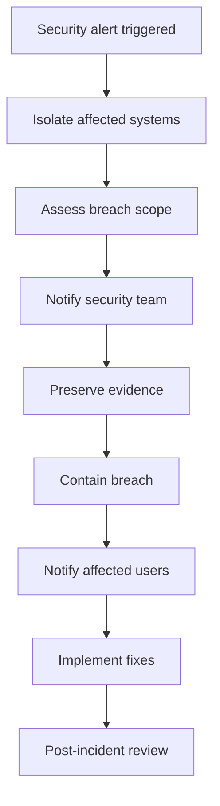

### 9.2 Data Privacy Request

#### GDPR Compliance Flow
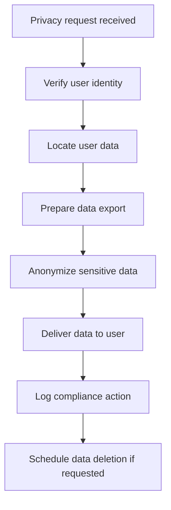

## 10. Mobile-Specific Flows

### 10.1 Offline Functionality

#### Offline Flow
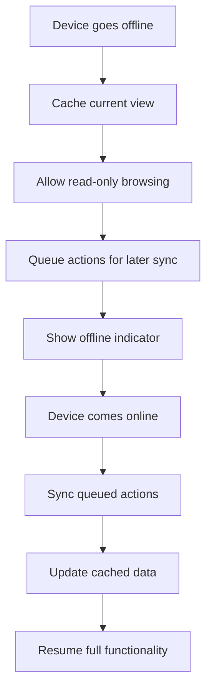

### 10.2 Push Notification Handling

#### Notification Flow
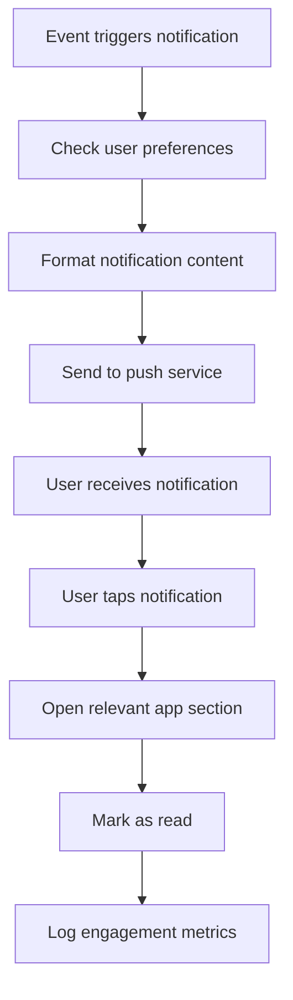

## 11. Integration Flows

### 11.1 Third-Party API Integration

#### API Call Flow
```mermaid
flowchart TD
    A[Platform needs external data] --> B[Check API rate limits]
    B --> C[Format API request]
    C --> D[Send request with authentication]
    D --> E[Handle API response]
    E --> F[Cache response data]
    F --> G[Process and store data]
    G --> H[Handle API errors gracefully]
```

### 11.2 Webhook Processing

#### Webhook Flow
```mermaid
flowchart TD
    A[External system sends webhook] --> B[Validate webhook signature]
    B --> C[Parse webhook payload]
    C --> D[Identify affected records]
    D --> E[Update platform data]
    E --> F[Trigger internal workflows]
    F --> G[Send confirmation response]
    G --> H[Log webhook processing]
```

## 12. Accessibility Flows

### 12.1 Screen Reader Support

#### Accessibility Flow
```mermaid
flowchart TD
    A[User with screen reader] --> B[Semantic HTML structure]
    B --> C[ARIA labels and roles]
    C --> D[Keyboard navigation support]
    D --> E[Alternative text for images]
    E --> F[Focus management]
    F --> G[Screen reader announces content]
    G --> H[User completes tasks successfully]
```

### 12.2 Keyboard Navigation

#### Keyboard Flow
```mermaid
flowchart TD
    A[User presses Tab] --> B[Move focus to next element]
    B --> C[Highlight focused element]
    C --> D[Announce element to screen reader]
    D --> E[User presses Enter/Space]
    E --> F[Activate element or open menu]
    F --> G[Continue navigation]
```

This comprehensive user flow documentation ensures all possible interactions are considered, from basic happy paths to complex edge cases and error scenarios, providing a solid foundation for implementation and testing.